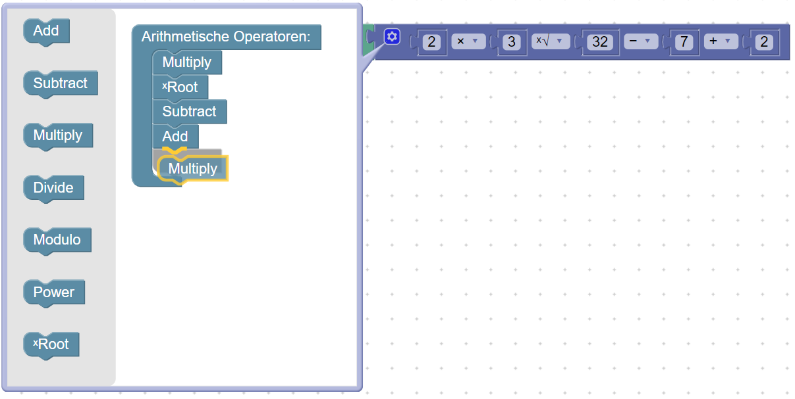
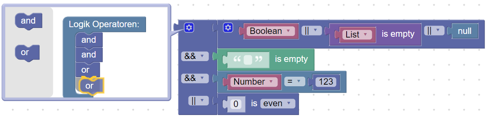
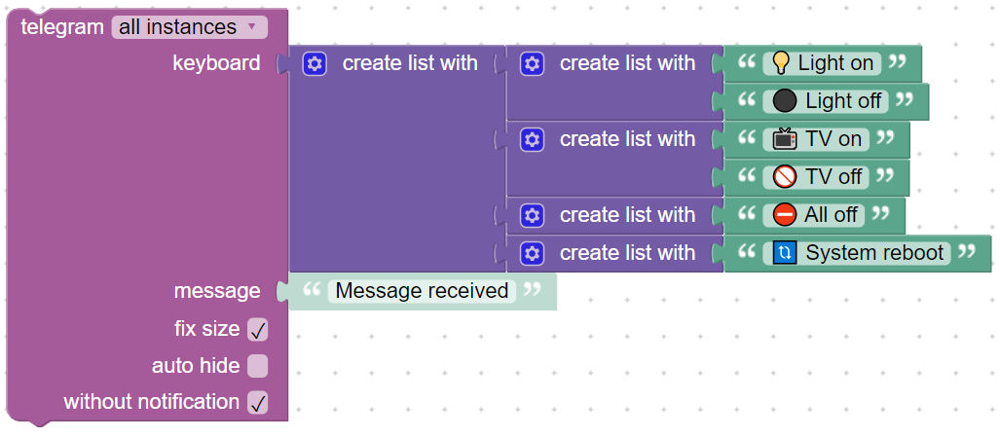
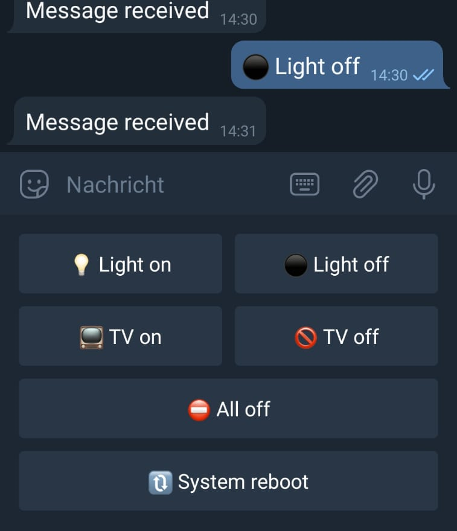
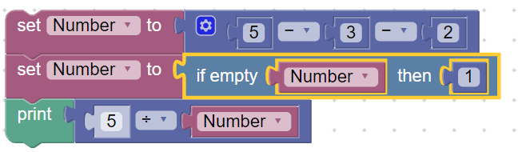

#  ioBroker - Blockly Plus
Add future blocks to ioBroker JavaScript-Blockly

 [ Github page](https://github.com/excal-foley/ioBroker.blockly-plus)

### Extract of blocks to be added

**> Multiple arithmetic- and logic-blocks <** 
 

**> Telegram keybord generator <** 

**> is value between this and that <** 

**> if empty then <** 

 

**> gets the index of list-loop <**

 

**> Multiple property/function-block <**

 

...and much more

### Note / Disclaimer

This project is in an early alpha phase.

The blocks could still contain bugs or be modified so that they are not downward compatible. For this reason they should'nt be transferred to a live/productive system.

You can view and test the blocks in sandbox.html, if the reposetory is copied to iobroker.

Currently the project is only translated into English and German.

This is my first project on Github and i hope i can give and get help.

### Manual

#### Install with web-interface

In adapter tab, click on the octocat-icon . Choose register "Any", insert the link `https://github.com/excal-foley/ioBroker.blockly-plus` and install.

#### Install with commands
`npm install https://github.com/excal-foley/ioBroker.blockly-plus`

You can view and test the blocks in **sandbox.html**

## Links

[this project - Github page](https://github.com/excal-foley/ioBroker.blockly-plus)

[ioBroker - Github page](https://github.com/ioBroker/ioBroker)

[ioBroker.javascript - Github page](https://github.com/ioBroker/ioBroker.javascript)

[ioBroker.telegram - Github page](https://github.com/iobroker-community-adapters/ioBroker.telegram)

[Google-Blockly - Github page](https://github.com/google/blockly)

[Google-Blockly - project page](https://developers.google.com/blockly/)

#### adapter was create with

- [haus-automatisierung.com - ioBroker Modulentwicklung](https://youtu.be/fUMtyYOtRcQ)

- [Adapter Development Documentation](https://github.com/ioBroker/ioBroker/wiki/Adapter-Development-Documentation)

- [ioBroker.template](https://github.com/ioBroker/ioBroker.template)

## License
[The MIT License (MIT)](https://github.com/excal-foley/ioBroker.blockly-plus/blob/master/LICENSE)

Copyright (c) 2020 Excal Foley <excal.foley@gmail.com>
